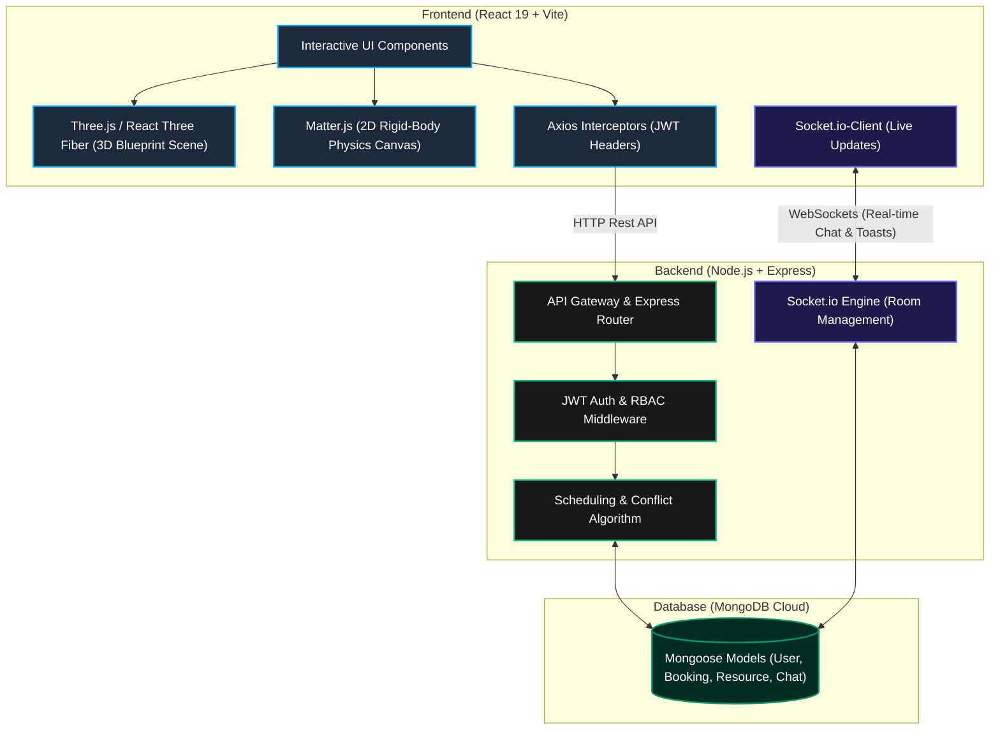

# 📐 Structura | Blueprint Resource Scheduler

[](https://react.dev)
[](https://vite.dev)
[](https://tailwindcss.com)
[](https://expressjs.com)
[](https://www.mongodb.com)
[](https://socket.io)

**Structura** (Blueprint Resource Scheduler) is a comprehensive, full-stack resource management and scheduling platform built to streamline reservations of computer labs, auditoriums, classrooms, and conference rooms.

Designed with a premium, creative **"architectural blueprint" aesthetic**, the platform ditches cookie-cutter corporate grids for dynamic hand-drawn tape accents, blueprint grid backgrounds, and custom canvas-driven simulations. It offers high-fidelity experiences across three user roles: **Students/Users**, **Administrators**, and **Maintenance Staff**.

---

## 🏛️ System Architecture

The following diagram illustrates the real-time, event-driven data flow and multi-tier role-based structure of Structura:



---

## ✨ Core Features

### 🔑 1. Multi-Tier Role-Based Access Control (RBAC)
* **Students/Users:** Browse live facility inventory, submit custom booking requests, track booking histories, and open support chats with administration.
* **Administrators:** Oversee analytics dashboards, approve or deny requests, toggle system settings (e.g., Maintenance Mode), and answer live client support threads.
* **Maintenance Staff:** Track automated sanitation workflows and update cleanup statuses.

### 🧹 2. Intelligent Conflict-Prevention & Auto-Scheduling
* **Automated Buffers:** The system automatically places a **30-minute cleaning and maintenance buffer** immediately following any approved booking, ensuring the room is sanitized.
* **Schedule Optimization (Garbage Collection):** If a booking is subsequently cancelled or rejected, the system automatically purges the associated buffer, freeing up the inventory.
* **Overlap Protection:** Database-level transactional validation blocks simultaneous overlaps.

### 💬 3. Real-Time Room-Based Sockets
* **Dedicated Help Desks:** Users can open persistent real-time chat sessions with Admin. Sockets are separated into room ids (e.g., `user_123`, `admin`) to protect communications.
* **Global Push Alerts:** Custom-animated, socket-triggered toast alerts notify users instantly when an administrator approves/rejects bookings.

### 📐 4. Immersive Canvas Simulations
* **Three.js 3D Blueprint:** Features fully responsive, interactive architectural models that smoothly rotate and scale dynamically based on your viewport.
* **Matter.js 2D Physics:** Responsive physical tags representing system properties that drag, bounce, and interact.
  * **Touch-Repulsion Shockwaves:** Tapping or clicking anywhere in the container unleashes an immediate outwards velocity impulse (shockwave) that flings nearby bodies away.
  * **Device Tilt Gravity:** Mobile gyroscope integration maps phone tilt (`gamma`/`beta`) directly to real-time 2D physics gravity vectors.

---

## 🛠️ Technology Stack

| Part | Tech Stack |
| :--- | :--- |
| **Frontend Core** | React 19 (Vite), React Router v7, Axios (Interceptors) |
| **Styling & Icons** | Tailwind CSS v4, Lucide React |
| **Animations & 3D** | GSAP, Three.js, React Three Fiber (R3F), `@react-three/drei` |
| **2D Physics** | Matter.js |
| **Backend Core** | Node.js, Express.js, Socket.io |
| **Database** | MongoDB & Mongoose ODM |
| **Security** | JSON Web Tokens (JWT), bcryptjs |

---

## 🚀 Getting Started

### Prerequisites
* [Node.js](https://nodejs.org) (v18+ recommended)
* [MongoDB Atlas](https://www.mongodb.com/cloud/atlas) or a local MongoDB database instance

---

### 1. Setup Backend Server

1. Open your terminal and navigate to the `Backend` directory:
   ```bash
   cd Backend
   ```
2. Install dependencies:
   ```bash
   npm install
   ```
3. Create a `.env` file in the `Backend` directory and define your configurations:
   ```env
   PORT=5000
   MONGO_URI=your_mongodb_connection_string
   JWT_SECRET=your_jwt_signing_key
   ```
4. Seed the database with initial resources and administrative accounts:
   ```bash
   node seed_db.js
   ```
5. Run the server in development watch mode:
   ```bash
   npm start
   ```
   *The backend server will run on `http://localhost:5000`.*

---

### 2. Setup Frontend Application

1. In a new terminal window, navigate to the `Frontend` directory:
   ```bash
   cd Frontend
   ```
2. Install dependencies:
   ```bash
   npm install
   ```
3. Create a `.env` file in the `Frontend` directory:
   ```env
   VITE_API_URL=http://localhost:5000
   ```
4. Start the Vite development hot-reloading server:
   ```bash
   npm run dev
   ```
   *Open `http://localhost:5173` in your browser to experience Structura.*

---

## 📦 Production Builds & Deployment

### Compile Frontend Asset Bundles
To generate optimized, static HTML/CSS/JS bundles for Vercel, Netlify, or AWS:
```bash
cd Frontend
npm run build
```
This produces a compiled, light-weight build folder under `Frontend/dist`.

---

## 📜 Development & Support Credits
Project created as an advanced, high-fidelity resource manager. For maintenance, bugs, or feature additions, please submit a pull request or open an issue on the repository.

*Designed with ❤️, Precision, and Blueprint aesthetics.*
